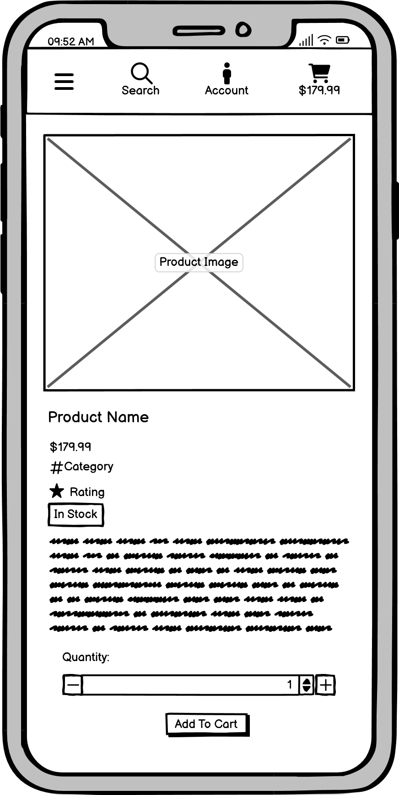
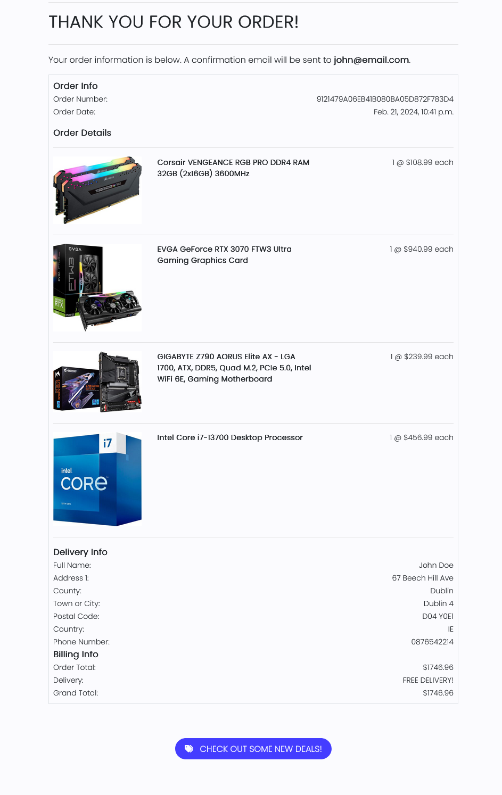

# Nextech - Your Source for Premium Computer Components and Systems

Welcome to Nextech, where we specialize in providing high-quality computer components and fully built systems tailored to meet your needs. Whether you're a gamer seeking top-tier hardware or a professional in search of reliable office setups and laptops, Nextech offers a diverse range of products to elevate your computing experience. From CPUs and GPUs to custom-built gaming PCs and office workstations, we prioritize quality, performance, and customer satisfaction. Explore our catalog and take the next step in enhancing your computing journey with Nextech.

The live project can be accessed [here](https://nextech-5db9177526a4.herokuapp.com/)

<p align="center">
    
</p>

## Index – Table of Contents

* [UI/UX](#uiux)
* [Business Model](#business-model)
* [SEO](#seo)
* [Agile Development](#agile-development)
* [User Stories](#user-stories)
* [Database Structure](#database-structure)
* [Wireframes](#wireframes)
* [Features](#features)
* [Technologies Used](#technologies-used)
* [Testing](#testing)
* [Bug Fixes](#bug-fixes)
* [Known Bugs](#known-bugs)
* [Deployment](#deployment)
* [Credits](#credits)
* [Acknowledgements](#acknowledgements)

## UI/UX

### Design Overview
The primary objective of the website is to offer users a curated selection of products tailored to the needs of computer enthusiasts. With an intuitive design at its core, our platform prioritizes simplicity and ease of navigation. Products are prominently displayed across various pages, encouraging users to explore further, while bold colors are strategically used to enhance visibility and attract attention. The commitment to seamless user experience is evident in every aspect of the site, with effortless accessibility and self-explanatory features. On-screen feedback messages are employed to guide users effectively, ensuring a smooth and enjoyable browsing experience.

### Colour Scheme

The color scheme of the site was carefully selected to create a visually appealing and cohesive user experience. Rich black serves as the primary color for all text elements throughout the site, ensuring clear readability and a sleek aesthetic. It is also strategically employed alongside other blue buttons to accentuate differences between various interactive elements. Complementing the richness of black, white is utilized for the site background, providing a clean canvas for content and enhancing contrast. Additionally, white is applied to icons and text displayed on blue or black backgrounds, ensuring optimal visibility and legibility across all interfaces.

In terms of accent colors, Chrysler Blue takes center stage in the navigation menu, adding a pop of vibrancy and guiding users seamlessly through different sections of the site. This bold hue also doubles as a hover effect on Palatinate Blue buttons, enhancing interactivity and user engagement. Chrysler Blue is also applied to the prices of products, making them stand out more and catching the attention of users browsing through the offerings on the site. Palatinate Blue serves as the predominant color for most buttons on the site, offering a harmonious blend of sophistication and functionality. Finally, Periwinkle adds a touch of softness and elegance as the background color for product cards, providing a pleasant backdrop for showcasing the curated selection of products. Together, these carefully chosen colors contribute to a visually appealing and intuitive browsing experience for users.

[Coolors.co](https://coolors.co/) was used to generate the images of the colour palettes below.

#### Site Colour Pallet

<p align="center">
    
</p>

- `#050316` used for text elements and buttons.
- `#FBFBFE` used for site background and text on dark backgrounds.
- `#2F27CE` used for site nav and hover effect.
- `#DDDBFF` used for product card backgrounds.
- `#443DFF` used for buttons.


### Fonts & Icons
- The 'Poppins' font was used for all text on the site. 

This font was sourced from [Google Fonts](https://fonts.google.com/).

- Up Arrow icon used back to top button.
- Shopping Cart icon used for cart navigation items.
- Chevron Left used for back buttons.
- Chevron Right used for newsletter submit button.
- Hastag used for categories on product cards.
- Star used for product ratings.
- Lock used for checkout buttons.
- Mangifying Glass used for search functions.
- Rotate Right Arrow used for update product buttons.
- Trash Can used for delete product from cart buttons.
- User icon used for user profile
- Bars icon used for mobile navigation dropdown.

Icons sourced from [Font Awesome](https://fontawesome.com/).

## Business Model

### Business Overview

Nextech is a dynamic B2C e-commerce platform specializing in computer components and fully built systems. Our mission is to deliver high-quality, cutting-edge products to our customers through an intuitive online store. With a diverse range of products, spanning from affordable computer components to premium gaming systems, Nextech aims to cater to tech enthusiasts of all levels.

### Key Advantages

- Scalability: The online nature of the business allows for easy scalability as it grows.
- Global Reach: With no need for a physical location, it can reach customers worldwide.
- Niche Targeting: Nextech can focus on specific niches within the tech industry, fostering brand loyalty and resonance with its target audience.
- Cost Efficiency: Starting up is relatively low-cost, allowing for a greater budget allocation to customer acquisition strategies like advertising and marketing.
- Impulse Buying: NexTechs competitive pricing encourages impulse buying, appealing to customers considering a purchase.

### Challeneges

- Initial Customer Acquisition: Competition saturation in certain sectors can pose challenges in attracting initial customers.
- Brand Establishment: Building a brand from scratch requires time and a robust marketing strategy for effective results.
- Marketing Efforts: Getting more visitors to the site naturally requires actively promoting it or investing in paid ads.
- Trust Building: Lack of physical presence can make it challenging to build trust and loyalty without offering discounts or incentives.
- Order Volume: Given that some products are at a high price point, it could be challenging to persuade customers to make purchases due to the higher upfront cost.

### Site Users

Nextech caters to a broad spectrum of tech-savvy individuals ranging from avid gamers and DIY enthusiasts to professionals and students, all seeking reliable and high-quality computing solutions tailored to their unique requirements. Generally the demographic of target site users of Nextech are primarly tech and computer enthusiasts between the ages of 18-50.

### Goals

- Seamless Navigation: Provide an easy-to-navigate website with a clear purpose.
- Product Satisfaction: Offer products that meet users' expectations in terms of quality and functionality.
- Enhancing Customer Engagement: Aim to foster meaningful interactions and relationships with site visitors by encouraging participation in community forums.
- Convenient Checkout: Allow for quick and hassle-free checkout experiences.
- User Profiles: Enable users to create profiles to view past orders and update account information.

### Marketing Strategy

- Social Media Promotion: Leverage Facebook business page for promotion and engage friends and family for wider reach.
- Launch Sale: Initiate a soft online launch sale to drive early adoption and purchases.
- Email Marketing: Utilize the in built newsletter sign up to build a subscriber base and send out offers and promotions.
- Content Marketing: Create meaningful forum posts to boost SEO ranking and enhance visibility on search engines.
- Paid Advertising: Explore avenues like Google Ads and Facebook Ads to target our demographic effectively.
- Influencer Collaborations: Partner with influencers in the tech niche to promote our products and drive traffic to the site. Targeting micro-influencers with a following of at least 10,000 is a feasible strategy within our budget constraints.

## SEO

### SEO Project Planning

Once the business model was decided on as an a computer parts store I started working on how to market the site and what keywords to target. I utilised [Google Trends](https://trends.google.com/trends/) to find more popular search terms and also used a tool called [SEOquake](https://chromewebstore.google.com/detail/seoquake/akdgnmcogleenhbclghghlkkdndkjdjc?pli=1) to compare the competition and see what they are doing well. I checked for a number of keywords on [Wordtracker](https://www.wordtracker.com/) to gain helpful insights on what keywords were high in traffic and competitive. From there I developed a list of short tail and long tail keywords I intended to use in this project.

### Keywords

Short Tail - Computer Components, Gaming PCs, Office PCs, Laptops, Computer Store, Tech Shop, Laptop Computers, Notebook PCs, Computer Accessories, Tech Deals, Computer Hardware, PC Components, Gaming Gear, Desktop PCs, Laptop Deals, Electronics Store, Computer Accessories, Tech Gadgets, Custom PCs, Computer Peripherals.

Long Tail - High-performance Gaming PC, High-end Gaming Desktop PCs, Budget Gaming Laptop Deals, Best Laptop Computers for Students, Gaming PC Accessories Bundle, Custom Gaming PC Configurator Tool, Gaming Laptop with RTX Graphics, Business Desktop PC with SSD, Lightweight Ultrabooks for Travel, Budget-Friendly PC Components and Accessories.

### Sitemap.xml

I generated a sitemap for the site using [XML-Sitemaps](https://www.xml-sitemaps.com/) to ensure effective indexing by search engines like Google once it's ready

### Robots.txt

I created a robots.txt file to guide Google's crawling process on the site. Specifically, I've disallowed the accounts and cart URLs since they hold no relevance for Google's indexing purposes. Additionally, I've included the sitemap in the robots.txt file for easy reference.

### FaceBook Business Page

Given the possibility of the Facebook Business page being removed due to the company not being recognized as legitimate, I chose to create a mockup of the Facebook Page using [Balsamiq](https://balsamiq.com/wireframes). Below, you'll find a preview of what the NexTech Facebook page would include.

<p align="center">
    
</p>

## Agile Development

Launching this project alongside a GitHub Projects Page was a strategic decision aimed at effectively measuring and managing the anticipated workload. The primary objective was to outline the projected workload, identify key epics, and subsequently break them down into actionable user stories or bite-sized tasks. This approach allowed for a systematic approach to project management, ensuring clarity of goals and progress tracking throughout the development process.

To see Kanban please click [here](https://github.com/users/MarkD117/projects/7).

By utilizing GitHub Projects, I was able to organize tasks and assign priorities in the form of the GitHub labels to ensure timely completion of the site. At the initial planning stages, I meticulously designed each page, outlining the requirements and features I intended to incorporate. From these detailed page plans, I derived user stories that served as the backbone of the development process. 

These user stories were strategically implemented to ensure seamless functionality across the site, with a particular focus on the customer journey—from product discovery to cart addition and ultimately, final purchase. By prioritizing core functionalities and user interactions, I aimed to create an intuitive and efficient browsing experience for our users.

For each user story, acceptance criteria were established along with corresponding tasks. As tasks were completed, the respective box was checked off. Upon fulfillment of all components of the user story and meeting the acceptance criteria, the user story transitioned from the **'In Progress'** column to the **'Completed'** column.

#### User stories

####  Completed User Stories

Click on a user story below to be directed to the Kanban project to examine any of the additional details of the user stories. If the specific story does not appear automatically, please click on it from the project page for more details.

 1. [USER STORY: Product List](https://github.com/MarkD117/nextech/issues/2)
 2. [USER STORY: View Products Without an Account](https://github.com/MarkD117/nextech/issues/4)
 3. [USER STORY: Product Details](https://github.com/MarkD117/nextech/issues/5)
 4. [USER STORY: Deals and Special Offers](https://github.com/MarkD117/nextech/issues/7)
 5. [USER STORY: Total Price](https://github.com/MarkD117/nextech/issues/8)
 6. [USER STORY: Create Account](https://github.com/MarkD117/nextech/issues/9)
 7. [USER STORY: Login/Logout](https://github.com/MarkD117/nextech/issues/11)
 8. [USER STORY: Password Reset](https://github.com/MarkD117/nextech/issues/12)
 9. [USER STORY: Confirmation Email](https://github.com/MarkD117/nextech/issues/13)
 10. [USER STORY: User Profile](https://github.com/MarkD117/nextech/issues/14)
 11. [USER STORY: Filters](https://github.com/MarkD117/nextech/issues/15)
 12. [USER STORY: Product Categories](https://github.com/MarkD117/nextech/issues/16)
 13. [USER STORY: Product Search](https://github.com/MarkD117/nextech/issues/17)
 14. [USER STORY: Numerous Category Search](https://github.com/MarkD117/nextech/issues/18)
 15. [USER STORY: Viewing Search and Filter Results](https://github.com/MarkD117/nextech/issues/19)
 16. [USER STORY: Add to Cart](https://github.com/MarkD117/nextech/issues/20)
 17. [USER STORY: Quantity Selection](https://github.com/MarkD117/nextech/issues/22)
 18. [USER STORY: Adjust Cart Quantity](https://github.com/MarkD117/nextech/issues/23)
 19. [USER STORY: Secure and Easy Payment System](https://github.com/MarkD117/nextech/issues/24)
 20. [USER STORY: Order Confirmation](https://github.com/MarkD117/nextech/issues/25)
 21. [USER STORY: Order Email Confirmation](https://github.com/MarkD117/nextech/issues/26)
 22. [USER STORY: Newsletter](https://github.com/MarkD117/nextech/issues/27)
 23. [USER STORY: Contact Form](https://github.com/MarkD117/nextech/issues/28)
 24. [USER STORY: Adding Products](https://github.com/MarkD117/nextech/issues/38)
 25. [USER STORY: Edit/Update Products](https://github.com/MarkD117/nextech/issues/39)
 26. [USER STORY: Delete Products](https://github.com/MarkD117/nextech/issues/40)
 27. [USER STORY: Wishlist](https://github.com/MarkD117/nextech/issues/45)
 

####  Incompleted User Stories

The following user stories have been marked as incomplete, as they were considered non-essential for the core functionality of the site at this stage. However, they represent potential [Future Features](#future-features) to be implemented in future iterations. While these issues have been closed and moved to the Out of Scope column within the Kanban board.I am eager to revisit and incorporate them into a future patch of the site.

The majority of the 18 out of 45 incomplete user stories pertain to a single app known as the forums app, along with the associated admin logic. While these features were deemed non-essential for the core functionality of the site during the initial development phase, they again represent potential additions for future updates.

 1. [USER STORY: Landing Page](https://github.com/MarkD117/nextech/issues/1)
 2. [USER STORY: Stock Availability](https://github.com/MarkD117/nextech/issues/3)
 3. [USER STORY: Multiple Product Images](https://github.com/MarkD117/nextech/issues/6)
 4. [USER STORY: Social Media Signup](https://github.com/MarkD117/nextech/issues/10)
 5. [USER STORY: Buy Now Button](https://github.com/MarkD117/nextech/issues/21)
 6. [USER STORY: Dedicated Forum](https://github.com/MarkD117/nextech/issues/29)
 7. [USER STORY: Create Forum Post](https://github.com/MarkD117/nextech/issues/30)
 8. [USER STORY: Edit/Update Posts](https://github.com/MarkD117/nextech/issues/31)
 9. [USER STORY: Delete Posts](https://github.com/MarkD117/nextech/issues/32)
 10. [USER STORY: Comment/Reply on Forum Posts](https://github.com/MarkD117/nextech/issues/33)
 11. [USER STORY: Post Detail View](https://github.com/MarkD117/nextech/issues/34)
 12. [USER STORY: Site Pagination](https://github.com/MarkD117/nextech/issues/35)
 13. [USER STORY: Forum Post Upvotes](https://github.com/MarkD117/nextech/issues/36)
 14. [USER STORY: Forum Search](https://github.com/MarkD117/nextech/issues/37)
 15. [USER STORY: Admin - Create Forum Post](https://github.com/MarkD117/nextech/issues/41)
 16. [USER STORY: Admin - Edit/Update Posts](https://github.com/MarkD117/nextech/issues/42)
 17. [USER STORY: Admin - Delete Forum Posts/Replies](https://github.com/MarkD117/nextech/issues/43)
 18. [USER STORY: View Contact Form Contents](https://github.com/MarkD117/nextech/issues/44)


## Database Structure

During the project's planning stages, [Lucid Chart](https://www.lucidchart.com/) played a crucial role in designing the initial database structure, facilitating the planning of data storage and relationships for the site.

Although the database structure for the forums app was initially planned during the development phase, changes were implemented due to time constraints and project scope, leading to the postponement of the forums app for the time being.

In place of the forums app, the wishlist feature and app were developed. Since this app and its corresponding database structure were not part of the initial plan, they were not included in the original database diagram.

Furthermore, it's worth noting that the profile image field in the UserProfile model was removed due to its perceived insignificance at the time. Originally intended for prominence within the forums, where each user's profile image would display alongside their posts and replies, this feature may be reconsidered for inclusion in a future patch

<p align="center">
    
</p>

## Wireframes

During the planning stages, I  created wireframes for all pages of the site. [Balsamiq](https://balsamiq.com/wireframes) was used to design the digital wireframes. All wireframes can be seen below.

### Home Page Wireframes

<details>
<summary>Click to see the Home Page Wireframes</summary>

| Type | Image |
| --- | --- |
| Desktop |  |
| Mobile |  |

</details>

### Products Page Wireframes

<details>
<summary>Click to see the Products Page Wireframes</summary>

| Type | Image |
| --- | --- |
| Desktop |  |
| Mobile |  |

</details>

### Product Detail Page Wireframes

<details>
<summary>Click to see Product Detail Page Wireframes</summary>

| Type | Image |
| --- | --- |
| Desktop |  |
| Mobile |  |

</details>

### Shopping Cart Page Wireframes

<details>
<summary>Click to see the Shopping Cart Page Wireframes</summary>

| Type | Image |
| --- | --- |
| Desktop |  |
| Mobile |  |

</details>

### Checkout Page Wireframes

<details>
<summary>Click to see the Checkout Page Wireframes</summary>

| Type | Image |
| --- | --- |
| Desktop |  |
| Mobile |  |

</details>

### Order Confirmation Page Wireframes

<details>
<summary>Click to see the Order Confirmation Page Wireframes</summary>

| Type | Image |
| --- | --- |
| Desktop |  |
| Mobile |  |

</details>

### Profile Page Wireframes

<details>
<summary>Click to see the Profile Page Wireframes</summary>

| Type | Image |
| --- | --- |
| Desktop |  |
| Mobile |  |

</details>

### Product Management Page Wireframes

<details>
<summary>Click to see the Product Management  Page Wireframes</summary>

| Type | Image |
| --- | --- |
| Desktop |  |
| Mobile |  |

</details>

### Contact Form Page Wireframes

<details>
<summary>Click to see the Contact Form Page Wireframes</summary>

| Type | Image |
| --- | --- |
| Desktop |  |
| Mobile |  |

</details>

## Features

### Navigation Menu

The NexTech site boasts a multi-page layout accessible via a top-mounted navigation bar. Developed using Bootstrap, the navigation bar underwent customizations tailored to the site's unique requirements. Featuring a sleek and responsive design, the navigation menu seamlessly adapts to both mobile and desktop layouts, complemented by a stylized logo for enhanced branding.

Notably, certain navigation options dynamically adjust based on user authentication status. For instance, visitors who aren't logged in will encounter prompts to register or log in. In contrast, authenticated users gain access to additional features such as the ability to log out, manage drafts, and add projects. Moreover, the 'Product Management' link remains exclusive to site administrators, ensuring restricted access solely for authorized personnel.

- Desktop

<p align="center">
    
</p>

- Mobile

<p align="center">
    
    
</p>

On the home page, the navigation menu adopts a stylish feature where its background becomes transparent when positioned at the top of the viewport and only adopts its background color upon scrolling. This design choice ensures the readability of menu options while seamlessly integrating with the captivating background video, allowing it to remain the focal point of the page.

- Transparent Nav bar

<p align="center">
    
</p>

When a user adds a product to their cart, the cart icon and total will update dynamically, showing the current total of the bag. The icon will also change to yellow which clearly identifies that the user has added an item to their shopping cart.

<p align="center">
    
    
</p>

### Site Footer

TThe site footer was designed to serve dual purposes: offering users additional information and enhancing website functionality. It contains a brief description of the site, a convenient newsletter sign-up form, essential navigation links, contact details, and a direct link to the contact form. Designed with responsiveness in mind, the footer seamlessly adjusts to both mobile and desktop layouts, ensuring optimal accessibility across all devices.

- Desktop

<p align="center">
    
</p>

- Mobile

<p align="center">
    
</p>

### **Home Page**

### **Hero Background Video**

The home page features a captivating background video showcasing computer games, a high-performance gaming PC, and its components in action. This dynamic visual element instantly helps users quickly understand what the site is about and what it has to offer.

<p align="center">
    
</p>

### **Account Pages**

### Register Page

If a new site user does not yet have an account, they can sign up using the register page. On this page they are prompted to enter a username, optional e-mail, and password. Once the information is correctly entered, the user can click the sign up button and they will be automatically logged into the site and redirected to the home page.

<p align="center">
    
</p>

### Login Page

If a user already has an account and wishes to log in, they can navigate to the Login page. Here, they can input their username and password to gain access to the site. Additionally, users have the option to choose whether they want the site to remember their login credentials for future visits. In case a user unintentionally lands on the login page without having created an account, a brief message prompts them to first sign up. This message includes a link directing them to the Register page for easy access to the registration process.

<p align="center">
    
</p>

### Logout Page

When a user is already logged into the site and wishes to log out, they can do so through the Logout page. Clicking on the logout navigation link directs the user to this page. Here, an on-screen prompt appears, asking the user to confirm if they want to sign out from the site. If the user selects the sign-out option, they are immediately logged out from the site, ensuring a seamless and efficient logout process.

<p align="center">
    
</p>

### Password Reset

If a user has forgotten their passowrd, they can click a reset password link loctated on the login page. This link will display a prompt to enter an email. Upon submitting a valid email, a message will appear notifying the user a link has been sent to the email to reset the account password.

<p align="center">
    
</p>

### Confirmation Email

When first registering an account on the site, a registration email will be sent to the users email. The email contains a link that allows them to confirm their email and access the site.

<p align="center">
    
    
</p>

### **Products Page**

### Product Cards

A clear list of products is presented to the user in the form of products cards. On each of the product cards are the product image, name, price, category and rating. Users do not need an account to view the products.

<p align="center">
    
</p>

### Filters

Users can choose from a selection of filters to sort the list of products to suit their needs.

<p align="center">
    
</p>

### Product Categories

Users can select individual categories to sort the curated list of products. The categories can be accessed from the navigation menus or can be accessed directly from the product cards by clicking the category.

Once a category has been selected, all products within the chosen category are displayed and badges with the selected categories can be accessed below the products heading. When these badges are clicked, the page will redirect to the selected category.

<p align="center">
    
</p>

### Product Search

The search icon can be selected at any point whilst viewing the site. This will show a search bar prompting for input. Search querys entered to this search bar will return results based on matching results within the product names of descriptions.

- Desktop

<p align="center">
    
</p>

- Mobile

<p align="center">
    
</p>

### **Product Detail Page**

### Product Details

Upon clicking the product image, the user is redirected to the product detail page of that specific product. There is more information shown such as if the product is in stock, the option to add to a wishlist, product description and a quantity form.

The quantity form allows users to add a defined quantity of the specific product to their cart. The plus and minus buttons may be used to increment the quantity. Below the product information are two buttons allowing users to add the product to their shopping cart or to return to the products page.

<p align="center">
    
</p>

### Stock Tag

The stock tag is currently only a cosmetic item that displays on all products. Future implementation of giving the stock tag a function could be added in the future. More mentioned in the [Future Features](#future-features).

<p align="center">
    
    
</p>

### **The Cart**

Users can add products to their cart from the products detail page. A message will show confirming the successful addition of a product to their cart. A summary of items within the cart will be shown in he message and the user can then click to view their cart. 

<p align="center">
    
</p>

### Shopping Cart Page

In the cart page, the user can view a summary of the products they entered including information such as the name, sku, seleted quantity and price. Users may also opt to edit the quantity of items within the cart. This can be done by adjusting the quantity form and clicking the update button. Alternatively, users can remove items from their cart by clicking the remove button.

below the product information is the billing information. If multiple products have been added, the total price of all products will be calculated and displayed here. Delivery on orders over $150 is free. This is denoted by messages and information on the cart page informing the users how much more they have to spend to get free delivery.

Below the billing information are two buttons that allow the user to continue to the checkout page or to go back to the products page.

- Delivery Threshold Met

<p align="center">
    
</p>

- Delivery Threshold Not Met

<p align="center">
    
    
</p>

### **Checkout**

Within The checkout page is a form that the user must complete in order to perform a successful checkout. Users can opt to save the delivery information to their profile. This information will then be auto filled within the form upon the next visit to the checkout page. If the user is logged in, they can access their profile from the account menu to view this saved delivery information. Also contained within the checkout page is a detailed order summary, showing each product image, name, sku, quantity and subtotal price. 

Below the order summary is the total cost of the order which is calculated from the products the user has added to their cart. The checkout features a Secure and Easy Payment System that utilises stripe webhooks for safe and efficient transactions. At the bottom of the checkout, there are buttons that allow the user to complete their order or redirect back to the shopping cart. There is also a message that notifies the user that their card will be charged a certain amount.

<p align="center">
    
</p>

### **Order Confirmation**

Once the order has been submitted and the payment has been completed. The user is presented with the checkout success page detailing their order information, order details, delivery infomation and billing information. As well as that, the user will get a success message explaining that a confirmation email has been sent to the users email. 

<p align="center">
    
    
</p>

### **Profile Page**

If a user has created an account, they can access the profile page in the account menu. On this page, they can see their saved delivery information and order history. From this page, users can update their saved delivery information and changes will be reflected upon accessing the checkout again. When the user clicks the truncated order number, they are redirected to the order confirmation page and are given an info message stating that this is a previous order.

<p align="center">
    
    
</p>

### **The Wishlist**

### Wishlist Button

If a user is logged in, an **Add to Wishlist** will appear on the procucts detail page. Upon clicking the button, the button will change to **Remove from Wishlist** and the product will be added to the wishlist along with a success message.

<p align="center">
    
    
</p>

### Wishlist Page

Site users must be logged in to access the wishlist page. On the wishlist page, users can see any products that they have added to their wishlist. This displays the product image, name, sku and unit price. If the wishlist is empty, text informing the user that they do not have anything in their wishlist appears. Users can also opt to remove items from their wishlist by clicking the remove button.

- Empty Wishlist

<p align="center">
    
</p>

- Wishlist Page

<p align="center">
    
</p>

### **Contact Form**

The contact form is a page that can be accessed through the site footer. Users can enter information to the relevant fields and upon submission, they will be redirected to the home page and a success message will appear.

<p align="center">
    
</p>

### **Admin Features**

Site admins have full access to all areas of the site. They also have full permission to add, edit, update and delete products on the site. This can be seen in the form of edit and delete buttons on each of the product cards and in each products detail page. The buttons will only be rendered in a user is an admin.

- Product Card Buttons

<p align="center">
    
</p>

- Product Detail Buttons

<p align="center">
    
</p>

### Add Product

The functionality for adding a product to the store can be accessed from clicking the account dropdown and selecting **Product Management**. This will display a form in which an admin can enter information and upload images to add a new product to the store.

<p align="center">
    
</p>

### Edit Product

To edit a product, site admins can click the aforementioned edit button and the product form will display prepopulated will the information pertaining to the specific product. An info message will appear informing the admin that they are editing a product. The admin can change any aspect of the products information and save the changes to the live site when finished.

<p align="center">
    
</p>

### Deleting a Product

If an admin wants to delete a product they can select the delete button on the product or product detail pages. When the delete button is clicked, a modal will appear asking for confirmation that the user does actually want to delete the product in question. This prevents the user from accidentally deleting an incorrect product.

<p align="center">
    
</p>

## Future Features

### Dedicated Forum

As the forums feature was initially discarded, I am interested in the addition of a dedicated forums section on the website in the future. This forums feature will serve as a platform where users can ask questions, seek advice, share experiences, and discuss all things related to computers. Whether it's troubleshooting errors, seeking recommendations for components or builds, or simply sharing knowledge and insights, users will have the opportunity to engage with a community of fellow enthusiasts. Additionally, users will be able to interact with each other by replying to posts and upvoting helpful contributions, facilitating the discovery of the most valuable and useful content.

### Stock Availability

As previously mentioned, the 'stock' tag currently serves as a cosmetic addition to the site's features. However, in future plans, I aim to enhance this functionality significantly. I would like to implement a feature that prevents users from adding out-of-stock products to their cart, thereby mitigating potential disappointment caused by long shipping times due to unavailability. Additionally, I plan to prompt users to add out-of-stock items to their wishlist. Subsequently, when these items are restocked, users will receive email notifications, ensuring they are promptly informed. This proposed enhancement not only provides functionality to the 'stock' tag but also gives it practical significance, enhancing the overall user experience.

### Buy Now Button

This subtle yet intuitive feature was discussed in the section on [incomplete users stories](#incompleted-user-stories) within the readme. While it wasn't integrated initially, as it was perceived as non-essential to the site's core functionality, I believe it could serve as a valuable addition to enrich the user experience. The proposed button would be strategically placed on each product detail page, offering users a convenient shortcut directly to the checkout page for a specific item. This streamlined approach aims to expedite the purchasing process, particularly for users intending to buy only one item.

## Technologies Used

- [HTML](https://developer.mozilla.org/en-US/docs/Web/HTML) was used to create the structure of the webpages and the base templating language.
- [CSS](https://developer.mozilla.org/en-US/docs/Web/CSS) was used to add custom styles when designing and styling the layout of the site.
- [Python3](https://en.wikipedia.org/wiki/Python_(programming_language)) was used to create the logic for the project.
- [JavaScript](https://developer.mozilla.org/en-US/docs/Web/JavaScript) used to add timeout function for messages
- [Django](https://www.djangoproject.com/) framework used to build the entire project.
- [Bootstrap v4.6.2](https://getbootstrap.com/docs/4.6/getting-started/introduction/) used as a base front end framework that works alongside Django.
- [Font Awesome](https://fontawesome.com/) used to include icons on the site.
- [Jinja Templating with Django](https://docs.djangoproject.com/en/4.2/topics/templates/#support-for-template-engines) used to render the logic within the html files and make the website more dynamic.
- [Lucid Chart](https://www.lucidchart.com/) used to database structure model.
- [Crispy Forms](https://django-crispy-forms.readthedocs.io/en/latest/) used to control the rendering behaviour of the django forms.
- [ElephantSQL](https://www.elephantsql.com/) used as a PostgreSQL database for the project during development and in production.
- [Git](https://www.atlassian.com/git/tutorials/what-is-git) used for version control.
- [GitHub](https://github.com/) used to store site source code.
- [GitPod](https://gitpod.io/) used as a cloud-based IDE for developing the site.
- [Heroku](https://id.heroku.com/) used to deploy the project.
- [Gunicorn](https://gunicorn.org/) used for WSGI server.
- [Allauth](https://docs.allauth.org/en/latest/) used for user authentication system.
- [AWS S3](https://aws.amazon.com/) used for hosting static & media files.
- [AWS IAM](https://aws.amazon.com/) used for permissions based roles for accessing the S3 buckets.
- [Stripe](https://stripe.com/) used for processing payment and webhooks.
- [XML-Sitemaps](https://www.xml-sitemaps.com/) used for generating sitemap.


## Testing

### Code Validation

[HTML W3C Validator](https://validator.w3.org) was used to validate the html code. No errors were found.

[CSS Jigsaw Validator](https://jigsaw.w3.org/css-validator) to validate all of my CSS files. No errors were found.

[CI Python Linter](https://pep8ci.herokuapp.com/) was used to validate the python code. Again, no errors were found.

[JSHint](https://jshint.com/) was used to validate the large javascript code. No errors were found.

For all validation images please navigate to [this](https://github.com/MarkD117/NexTech/tree/main/documentation/validation) folder.

### Browser Compatibility

The site has been tested on the following browsers:
- Google Chrome - ✔️
- Mozilla FireFox - ✔️
- Microsoft Edge - ✔️
- iOS (Mobile) - ✔️
- Android - ✔️

### Testing and Results

Each user story was carefully tested to ensure that the implemented features functioned as expected. Due to the fact that this project was driven by my own User Stories, I felt that manual testing should be performed on all logic code.

#### **Registration & User Accounts**

| Story | Test | Expected Outcome | Result | 
|--|--|--|--|
| Create Account | Register account in account menu | User can enter information to registration form providing adequate validation | pass
| Confirmation Email | Register account in account menu | User recieves a confirmation email allowing them to confirm their email and successfully register to the site | pass
| Login/Logout | Log into & out of account | Account login and logout process completes successfully | pass
| Password Reset | Click reset password link on login page | User recieves email allowing them to reset their password | pass
| User Profile | Log into site and access user profile page through account dropdown | User can view their personal profile, order history and save/update delivery information | pass

#### **Viewing & Navigation**

| Story | Test | Expected Outcome | Result | 
|--|--|--|--|
| Product List | Navigate to products page | All products and product information appear in a list in the form of cards | pass
| View Products Without an Account | Navigate to product page as a non logged in user | All products and product information appear in a list in the form of cards | pass
| Deals and Special Offers | Enter offers dropdown menu | List of products within the New Arrivals, Deals and Clearance Categories appear in a list | pass
| Total Price | Add products to the cart | Users total order cost updates dynamically on all pages of the site | pass
| Product Details | Click product image on products page | Redirected to new product detail page displaying product image, name, price, category, rating, stock status, description and quantity | pass

#### **Sorting & Searching**

| Story | Test | Expected Outcome | Result | 
|--|--|--|--|
| Filters | Select options in products sort select box | Products matching selected sorting criteria display in list format | pass
| Product Categories | Select specific categories from nav menu dropdowns | Products matching selected categories display in list format | pass
| Numerous Category Search | Sort products into specific category and use sort select box to filter categorised list | Categorised products display in list format ordered by selected sorting criteria | pass
| Product Search | Enter search query to search form inputs | Products are displayed in a list format whose name or description matches the submitted search query | pass
| Viewing Search and Filter Results | Filter products and search for products | Products are filtered and ordered correctly, and relevant results are displayed to the user | pass
| Wishlist | Add and remove producta to wishlist | When logged in, wishlist buttons appear, enabling users to add or remove products from their wishlist page. | pass

#### **Contact & Communication**

| Story | Test | Expected Outcome | Result | 
|--|--|--|--|
| Contact Form | Access contact form and submit data to form | Contact form loads correctly, and allows users to submit information with adequate validation | pass
| Newsletter | Add email to newsletter | Users can add their email to the newsletter form and submit correctly with validation and feedback messages | pass


#### **Purchasing & Checkout**

| Story | Test | Expected Outcome | Result | 
|--|--|--|--|
| Quantity Selection | Interact with quantity selector on product detail page | Form buttons update quantity and quantity changes are reflected in the shopping cart and order total calculations. Input validation is also present | pass
| Add to Cart | Add an item to the shopping cart using the buttons on the product detail page | Product gets successfully added to the cart, message shows success and order summary, cart order total updates correctly | pass
| Adjust Cart Quantity | Interact with quantity selector on shopping cart page | Form buttons update quantity and quantity changes are reflected in the shopping cart and order total calculations. Input validation is also present | pass
| Secure and Easy Payment System | Follow checkout process inputting form data and stripe test card info | Checkout process completes successfully redirecting the user to the order confirmation page with a success message | pass
| Order Confirmation | Complete checkout process | User is presented with a detailed break down of their order information, products they have ordered, delivery information and billing information | pass
| Order Email Confirmation | Complete checkout process | User gets sent a confirmation email from the site detailing their order, delivery and billing information | pass 


#### **Admin & Store Management**

| Story | Test | Expected Outcome | Result | 
|--|--|--|--|
| Adding Products | As an admin, navigate to product management in the account menu dropdown and enter form information | Admin users can access the add product form and successfully add a product to the store will all the relevant input vaidation present  | pass
| Edit/Update Products | As an admin, click the edit button on a product whilst on the products or product detail pages, change form information | Admin users can view and access the edit buttons and forms on the site. The forms populate with the relevant product information and all changes saved are refleted on the site | pass
| Deleting Products | As an admin, click the edit button on a product whilst on the products or product detail pages and click confirm delete on the modal | Admin users can view and access the delete buttons on the on the site. Clicking the delete button will display a modal asking for confirmation, clicking confirm delete will delete the specific product from the site | pass


## Bug Fixes

### Loading Spinner

The font awesome `fa-spin` class was not functioning correctly and the icon was not spinning when shown to the user with the loading overlay. Through testing and research, I found that the issue was to do with my personal font awesome kit. Using the kit that was specified in the walkthrough fixed this issue; however, when replacing my own kit, some of the site icons disappeared. Using both kits simultaneously fixed the missing icons and allowed the spinner spin correctly.

### Email Backends Server Error

When integrating a working email system to the site using Gmail I ran into a 500 server error when registering a new user to test the emails. The error pointed towards an issue with the email backends. Through research into the slack channels, I found a few users with the same issue. The error was solved by running the command `touch runtime.txt && echo "python-3.9.16" > runtime.txt` to create a runtime.txt file. After implementing this fix, the emails functioned correctly.

### Accessing Wishlist as New User

When developing and testing the Wishlist feature I noticed that when a new user was created, and they try to access the Wishlist page, an error appears saying that the a matching Wishlist query does not exist. The Wishlist page seemed to only appear successfully after a user has added at least one product to the Wishlist. Through my research into the issue, I found that the error was caused because the site is trying to retrieve a Wishlist object for the current user, but it doesn't exist if the user hasn't added anything to their Wishlist yet.

I found some [stackoverflow](https://stackoverflow.com/questions/17813919/django-error-matching-query-does-not-exist) questions addressing the error which noted to using `get_object_or_404` with a try-except block to handle the non-existent object. This wouldn’t work in this case as the Wishlist page must be accessible to logged in users at all times. I eventually found that I could use [`objects.create`](https://stackoverflow.com/questions/26672077/django-model-vs-model-objects-create) along with the try-except block to catch the `DoesNotExist` exception and provide a default response, which will create a new empty wishlist for the user and allow them to access the wishlist page.

**Bugged Code**
```python
@login_required
def view_wishlist(request):
    # Retrieve the wishlist of the current user
    wishlist = WishList.objects.get(user=request.user)

    context = {
        'wishlist': wishlist
    }

    return render(request, 'wishlist/wishlist.html', context)
```

**Fixed Code**
```python
@login_required
def view_wishlist(request):
    try:
        # Try to retrieve the wishlist of the current user
        wishlist = WishList.objects.get(user=request.user)
    except WishList.DoesNotExist:
        # If wishlist doesn't exist for the user, create a new one
        wishlist = WishList.objects.create(user=request.user)
    
    context = {
        'wishlist': wishlist
    }

    return render(request, 'wishlist/wishlist.html', context)
```

### Newsletter Form Display Issue

When implementing the newsletter form. The form was rendered in the footer of the root `base.html` file with crispy forms. When inspecting the code in the browser, the form input had an automatic type="hidden" on all other URLs on the site apart from the '/contact/subscribe' URL. This meant that the form only displayed on that specific URL. The original intended purpose for the newsletter was to be displayed on all pages in the footer.

The solution for the form to be displayed on all pages was to actually manually code in the form, due to needing a route to render a crispy form. This is global so I needed to do without crispy forms and manually add it.

**Bugged Code**
```html
<form method="post" action="">
    
    {{ NewsletterForm|crispy }}
    <button type="submit" class="btn btn-primary">Subscribe</button>
</form>
```
**Fixed Code**
```html
<form method="post" action="/contact/subscribe/" class="row" id="newsletter-form">
    
    <div id="div_id_newsletter_email" class="form-group col-md-8 col-sm-9 p-0">
    <div>
        <input type="email" name="email" maxlength="100" class="form-control emailinput"
        placeholder="Your email" required id="id_newsletter_email">
    </div>
    </div>
    <div class="col-md-4 col-sm-3" id="subscribe-btn">
    <button type="submit" aria-label="newsletter subscribe button" class="btn btn-blue w-100">
        <span class="icon">
        <i class="fas fa-chevron-right"></i>
        </span>
    </button>
    </div>
</form>
```

## Known Bugs

There are currently no known bugs with the site.

## Deployment

The program was deployed using [Heroku](https://id.heroku.com/). The following steps have been broken into sections to make them easier to follow.

### Create Database

1.	Create an account or log in to [ElephantSql](https://www.elephantsql.com/) to access your dashboard.
2.	Click **Create New Instance**.
3.	Set up your plan by giving it a **Name** (this is commonly the name of the project).
4.	Select the **Tiny Turtle (Free)** plan.
5.	Leave the Tags field blank.
6.	Select **Select Region**.
7.	Select a data center near you.
8.	Then click the green **Review** button.
9.	Check your details are correct and then click **Create instance**.
10.	Return to the **ElephantSQL Dashboard** and click on the database instance name for this project.
11.	In the **URL** section, clicking the copy icon will copy the database URL to your clipboard.

### Create Heroku App

1.	Create an account or log in to [Heroku](https://id.heroku.com/).
2.	Click **New** to create a new app.
3.	Give your app a **name**.
4.	select the **region** closest to you.
5.	Click **Create app** to confirm.
6.	Open the **Settings** tab.
7.	Scroll down to the **Config Var** row and click **Reveal Config Vars**.
8.	Add the config var `DATABASE_URL`, and for the value, copy in your database URL from ElephantSQL.
9.	Add `PORT: 8000` and the Django `SECRET_KEY` value to the Config Vars.

### Prepare IDE

1.	In the **terminal**, install **dj database url** and **psycopg2** using the command `pip3 install dj_database_url==0.5.0 psycopg2`.
2.	Update the **requirements.txt** file by using the command ` pip freeze > requirements.txt`.
3.	In **settings.py**, `import dj_database_url` **underneath the import for os**. The top of your settings.py code should look something like this;
```python
from pathlib import Path
import os
import dj_database_url
if os.path.isfile('env.py'):
    import env
```
4.	Scroll to the **DATABASES** section and update it to the following code, so that the original connection to sqlite3 is commented out and the connection is set to the new ElephantSQL database instead. Paste in your ElephantSQL database URL in the position indicate
```python
DATABASES = {
     'default': dj_database_url.parse('your-database-url-here')
 }
 ```
5.	In the terminal, run the **showmigrations** command to confirm you are connected to the external database `python3 manage.py showmigrations`.
6.	If you are, you should see a list of all migrations, but none of them are checked off.
7.	Migrate your database models to your new database using `python3 manage.py migrate`.
8.	In my case, I had already manually created categories and added products to the test database as I initially did not have a fixtures folder. To prevent having to manually enter the products and categories again. I used the `dumpdata` command to extract the products app model data to a .json object. The process was done through the [Django dumpdata documentation](https://docs.djangoproject.com/en/5.0/ref/django-admin/#dumpdata)
The following commands were used;
`python3 manage.py dumpdata products.ProductCategory  > products/fixtures/product_categories.json`
`python3 manage.py dumpdata products.Product  > products/fixtures/products.json`
9.	Load in the created fixtures. The order is very important. **Categories MUST be loaded first** with `python3 manage.py loaddata product_categories`
10.	Load the products with `python3 manage.py loaddata products`
11.	Create a superuser for the new database using `python3 manage.py createsuperuser`
12.	To prevent exposing the database when pushing to GitHub, remove the custom database from the databases section of settings.py and replace it with the original sqlite3 database configuration.

### Confirming Database

1.	On the ElephantSQL page for your database, in the left side navigation, select **BROWSER**.
2.	Click the **Table queries** button, select `auth_user`.
3.	When you click **Execute**, you should see the newly created superuser details displayed. This confirms the tables have been created and that data can be added to the database.

### Deploying to Heroku

1.	Add an if statement to the database in settings.py that only connects to postgres if the DATABASE_URL environment is present. This keeps the database URL out of version control.
```python 
if 'DATABASE_URL' in os.environ:
    DATABASES = {
        'default': dj_database_url.parse(os.environ.get('DATABASE_URL'))
    }
else:
    DATABASES = {
        'default': {
            'ENGINE': 'django.db.backends.sqlite3',
            'NAME': os.path.join(BASE_DIR, 'db.sqlite3'),
        }
    }
```
2.	Install **Guinicorn** with `pip3 install gunicorn`
3.	**Freeze** gunicorn into requirements with `pip3 freeze > requirements.txt`
4.	Create the `Procfile` in the root directory
5.	Add the following code to the file to tell Heroku to create a **web dyno** which will run gunicorn and serve the Django app `web: gunicorn your_app_name.wsgi:application`.
6.	Type `Heroku login` into the terminal of your editor and follow the steps to log in to Heroku.
7.	Temporarily **disable collectstatic** by using `heroku config:set DISABLE_COLLECTSTATIC=1 –app your-heroku-app-hostname` So that Heroku won't try to collect staticfiles upon deployment.
8.	Add **hostname** of the Heroku app to `ALLOWED_HOSTS`  in settings.py. The format should be the Heroku app name followed by .herokuapp.com.
9.	**Commit** all changes and push to **GitHub**.
10.	**Initialise the Heroku git remote** if the app was created through the Heroku dashboard. This can be done by typing: `heroku git:remote -a your-heroku-app-hostname`
11.	Deploy to Heroku using `git push heroku main`.

### Automtic Deployements

1.	Go to the **Heroku dashboard**.
2.	Click the specified app.
3.	Navigate to the **Deploy** tab.
4.	Click the **Connect to GitHub** button.
5.	Search for the repository name.
6.	Click **Connect**.
7.	Scroll down to Automatic Deploys and click **Enable Automatic Deploys**.

### AWS Configuration

#### Create a Bucket

1.	Navigate to [AWS](https://aws.amazon.com) and log in or create an AWS account.
2.	Search for the **S3** service or find it through the **services menu**.
3.	Open S3 and click **Create bucket**.
4.	Give the bucket a name (recommended using the app name).
5.	Select the **region closest** to you.
6.	In the Object Ownership Section select **ACLs enabled**.
7.	Set the Object Ownership to **Bucket owner preferred**.
8.	Untick **Block all public** access and select the **acknowledge that the bucket will be public** checkbox in order to allow public access to the static files.
9.	Once settings have been configured, click **Create bucket**.

#### Bucket Settings

##### **Static Website Hosting**

1.	Click the newly created bucket
2.	Navigate to the **Properties** tab and scroll down to the bottom to the **Static website hosting** section and click **Edit**.
3.	Click to **Enable** static website hosting.
4.	Set the default values of the index and error documents to `index.html` and `error.html`
5.	Click **Save changes**.

##### **CORS Configuration**

6.	Navigate to the **Permissions** tab
7.	Scroll down to the **Cross-origin resource sharing (CORS)** section and click **Edit**.
8.	Paste the following code into the **CORS** configuration;
```json
[
  {
      "AllowedHeaders": [
          "Authorization"
      ],
      "AllowedMethods": [
          "GET"
      ],
      "AllowedOrigins": [
          "*"
      ],
      "ExposeHeaders": []
  }
]
```
9.	Scroll to the **Bucket policy** section and click **Edit**.

##### **Security Policy**

10.	Click **Policy Generator** to create a security policy for the bucket.
11.	Set the policy type to **S3 Bucket Policy**.
12.	Allow all **Principals** by using a `*` in the principal field.
13.	Select the **Get Object** action.
14.	Get the **ARN** (Amazon Resource Name) from the **Edit bucket policy** page. This is generally in the format of `arn:aws:s3::::your_bucket_name `.
15.	Click **Add Statement**.
16.	Click **Generate Policy**.
17.	Copy the generated policy into the **Bucket policy editor**.
18.	Before clicking save changes, add a `/*` onto the end of the **resource key** to allow access to all resources in the bucket.
19.	Now click **Save changes**.

##### **Access Control List**

20.	Navigate to the **Access control list (ACL)** section and click **Edit**.
21.	Set the **list objects** permission for **everyone** on the **public access** section.
22.	Accept the **warning message** below.
23.	Click **Save changes**.

### Creating AWS Groups, Policies and Users

#### Create A Group

1.	Search for the **IAM** (Identity and Access Management) service or find it through the **services menu**.
2.	Open the **IAM Dashboard**.
3.	Dropdown the **Access management** menu from the sidebar and select **User groups**.
4.	Click **Create group**.
5.	Give the group a name. The name for this group is `manage-nextech`.
6.	Click **Create group**.

#### Create A Policy

7.	Select **Policies** from the sidebar.
8.	Click **Create Policy**.
9.	Go to the **JSON** tab.
10.	Click the actions dropdown and select **import policy**.
11.	Search for the **S3 full access policy**.
12.	Select the `AmazonS3FullAccess` policy and click **Import Policy**.
13.	To prevent allowing full access to everything, replace the resource value with the bucket **ARN**. This will allow full access to the bucket and everything within it. The resource value should look like this;
```json
"Resource": [
"arn:aws:s3:::your_bucket_name",
	"arn:aws:s3::: your_bucket_name /*"
]
```
14.	Once the policy is configured, click **Next**.
15.	Give the policy a **Name** and a **Description**.
16.	Click **Create policy**.

#### Add policy to group

17.	Navigate to User **Groups**.
18.	Select the group that has just been created.
19.	Go to the **Permissions** tab and open the **Add permissions** dropdown.
20.	Click **Attach policies**.
21.	**Search** for and then **select** the newly created policy.
22.	Click **Attach policy** to add it to the group.

#### Create a User

23.	Select **User**s from the sidebar.
24.	Click **Create user**.
25.	Giver the user a **name**. The user name used for this project is `nextech-static-files-user`.
26.	Click **Next**.
27.	Select the previously created group with the policy attached and click Next.
28.	Click into the user that has just been created.
29.	Scroll down to the **Access keys** section.
30.	Click **Create Access Key**.
31.	Select the **Other** use case option and click **Next**.
32.	Optionally give the key a **description** and click **Next**.
33.	Download the `.csv` file and click **Done**.

### Connect Django to S3

1.	Install the Django packages `boto3` and `Django Storages` using the commands;
`pip3 install boto3`
`pip3 install django-storages`
2.	Freeze the new packages into the requirements.txt file with `pip3 freeze > requirements.txt`
3.	Add `storages` to Installed apps within the settings.py file.
4.	To connect Django to S3 some settings need to be added to specify what bucket it will be communicating with. This will only need to apply on Heroku so an if statement is used to check if a `USE_AWS` variable is present in the environment.

The Bucket Configuration settings should look like the code snippet below;
```python
if 'USE_AWS' in os.environ:
    # Bucket Config
    AWS_STORAGE_BUCKET_NAME = 'your-bucket-name'
    AWS_S3_REGION_NAME = 'your-chosen-region'
    AWS_ACCESS_KEY_ID = os.environ.get('AWS_ACCESS_KEY_ID')
    AWS_SECRET_ACCESS_KEY = os.environ.get('AWS_SECRET_ACCESS_KEY')
    AWS_S3_CUSTOM_DOMAIN = f'{AWS_STORAGE_BUCKET_NAME}.s3.amazonaws.com'
```
5.	Go to the Heroku dashboard and add the AWS keys from the downloaded .csv file to the project Config Vars with the key names from the above snippet.
6.	Add the `USE_AWS` key with its value set to `TRUE` to use the AWS keys when deployed through Heroku.
7.	Remove the `DISABLE_COLLECTSTATIC` config var so Django will collect static files automatically and upload them to S3.
8.	Create a new file called `custom_storages.py` in the root directory.
9.	Import the `settings` and the `S3Boto3Storage` class from Django storages. 
10.	Create two custom classes to specify the storage location of the static files and media files. The custom storages file should look like this;
```python
from django.conf import settings
from storages.backends.s3boto3 import S3Boto3Storage

class StaticStorage(S3Boto3Storage):
    location = settings.STATICFILES_LOCATION

class MediaStorage(S3Boto3Storage):
    location = settings.MEDIAFILES_LOCATION

```
11.	In AWS if statement in the settings.py file, specify the location of static and media files, and, override the URLs in production. Add the below code to the if statement;
```python
# Static and media files
STATICFILES_STORAGE = 'custom_storages.StaticStorage'
STATICFILES_LOCATION = 'static'
DEFAULT_FILE_STORAGE = 'custom_storages.MediaStorage'
MEDIAFILES_LOCATION = 'media'

# Override static and media URLs in production
STATIC_URL = f'https://{AWS_S3_CUSTOM_DOMAIN}/{STATICFILES_LOCATION}/'
MEDIA_URL = f'https://{AWS_S3_CUSTOM_DOMAIN}/{MEDIAFILES_LOCATION}/'
````
12.	**Add/commit** the above changes and push to **GitHub**.

### Caching, Media Files & Stripe

#### Media Files

1.	Add a the below setting to the **settings AWS if statement** to tell the browser that it is okay to cache static files for a long time as they don’t change that often. This will improve performance site users.
```python
# Cache control
AWS_S3_OBJECT_PARAMETERS = {
    'Expires': 'Thu, 31 Dec 2099 20:00:00 GMT',
    'CacheControl': 'max-age=94608000',
}
```
2.	Add, commit and push to GitHub.
3.	Navigate to **S3** and select the **project bucket**.
4.	In the **Object tab**, select **Create folder**.
5.	Name the folder **media** and click **Create folder**.
6.	Click the created folder and select **Upload**.
7.	Click **Add files** and add all **media files** to the folder.
8.	Scroll down and open the **Permissions dropdown**.
9.	Enable **Grant public-read access** and accept the warning.
10.	Click **Upload** and the static files will start to upload to AWS.

#### Confirm Superuser Email on Postgres Database

11.	Open the **deployed Heroku** site and log in to the **Django admin panel**.
12.	Navigate to the **Email addresses tab** (**Note:** if you don’t see your email address, you may need to attempt to log in first to force Allauth to create it.)
13.	Select the **superuser email** and mark it as **Verified** and **Primary**.
14.	Click **Save** to save your changes.

#### Configuring Stripe

15.	Log into [Stripe](https://stripe.com/).
16.	Click **Developers**.
17.	Navigate to the **API Keys Tab** and get the **public** and **secret** API keys.
18.	Add the `STRIPE_PUBLIC_KEY` and `STRIPE_SECRET_KEY` values to the Heroku config vars.
19.	Configure a new **Stripe Webhook Endpoint** by navigating the Webhooks tab In the Stripe developer dashboard.
20.	Click **Add endpoint**.
21.	Add the URL for the deployed Heroku app followed by `/checkout/wh/`.
22.	Click Select **events** and check the Select all events option.
23.	Click **Add events**.
24.	Scroll down to the bottom of the page and select **Add endpoint**.
25.	Reveal the** Webhook Signing Secret** and add it to the Heroku config vars using the key name `STRIPE_WH_SECRET`.

The site is now fully deployed and configured with AWS and Stripe.

### Forking The Repository

By forking the GitHub Repository, you can create a copy of the original repository to view or modify without impacting the original.

The steps to do this are as follows: 

1.  Sign up or Login to [GitHub](https://github.com/)
2. Go to the repository which can be accessed [here](https://github.com/MarkD117/NexTech). 
3.  At the top of the repository, on the right side of the page, select **Fork**.
4.  A copy of the project repository should now be created as your own repository.

### Create Repository Clone

Making a clone allows you to make a duplicate of the repository at that moment in time, allowing you to execute a local copy of the project: 

This can be accomplished by the following steps:

1.   Navigate to the project [repository](https://github.com/MarkD117/NexTech)
2.   Click the dropdown arrow on the green code button at the top of code files.
3.   **Copy the URL** provided by the clone by https option to the clipboard.
4.   Navigate to your preferred code editor and change the directory within the terminal to the location where you wish to clone the repository.
5.   Type ```git clone``` and paste the https link you copied from github.
6.   Press **Enter** and git will clone the repository to your local machine.