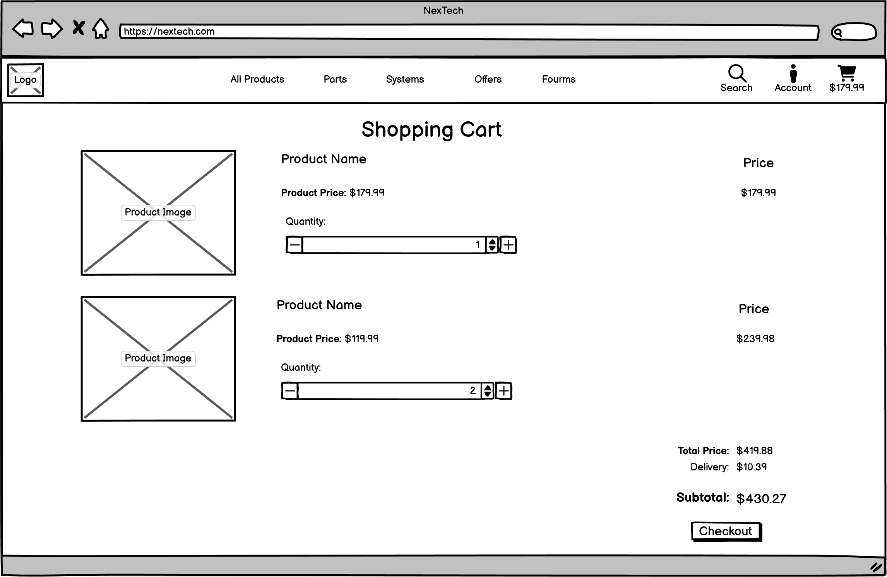

# Nextech - Your Source for Premium Computer Components and Systems

Welcome to Nextech, where we specialize in providing high-quality computer components and fully built systems tailored to meet your needs. Whether you're a gamer seeking top-tier hardware or a professional in search of reliable office setups and laptops, Nextech offers a diverse range of products to elevate your computing experience. From CPUs and GPUs to custom-built gaming PCs and office workstations, we prioritize quality, performance, and customer satisfaction. Explore our catalog and take the next step in enhancing your computing journey with Nextech.

The live project can be accessed [here](https://nextech-5db9177526a4.herokuapp.com/)

    

## Index – Table of Contents

* [UI/UX](#uiux)
* [Agile Development](#agile-development)
* [User Stories](#user-stories)
* [Database Structure](#database-structure)
* [Wireframes](#wireframes)
* [Features](#features)
* [Technologies Used](#technologies-used)
* [Testing](#testing)
* [Bug Fixes](#bug-fixes)
* [Known Bugs](#known-bugs)
* [Deployment](#deployment)
* [Credits](#credits)
* [Acknowledgements](#acknowledgements)

## UI/UX

### Design Overview
The primary objective of the website is to offer users a curated selection of products tailored to the needs of computer enthusiasts. With an intuitive design at its core, our platform prioritizes simplicity and ease of navigation. Products are prominently displayed across various pages, encouraging users to explore further, while bold colors are strategically used to enhance visibility and attract attention. The commitment to seamless user experience is evident in every aspect of the site, with effortless accessibility and self-explanatory features. On-screen feedback messages are employed to guide users effectively, ensuring a smooth and enjoyable browsing experience.

### Colour Scheme

The color scheme of the site was carefully selected to create a visually appealing and cohesive user experience. Rich black serves as the primary color for all text elements throughout the site, ensuring clear readability and a sleek aesthetic. It is also strategically employed alongside other blue buttons to accentuate differences between various interactive elements. Complementing the richness of black, white is utilized for the site background, providing a clean canvas for content and enhancing contrast. Additionally, white is applied to icons and text displayed on blue or black backgrounds, ensuring optimal visibility and legibility across all interfaces.

In terms of accent colors, Chrysler Blue takes center stage in the navigation menu, adding a pop of vibrancy and guiding users seamlessly through different sections of the site. This bold hue also doubles as a hover effect on Palatinate Blue buttons, enhancing interactivity and user engagement. Chrysler Blue is also applied to the prices of products, making them stand out more and catching the attention of users browsing through the offerings on the site. Palatinate Blue serves as the predominant color for most buttons on the site, offering a harmonious blend of sophistication and functionality. Finally, Periwinkle adds a touch of softness and elegance as the background color for product cards, providing a pleasant backdrop for showcasing the curated selection of products. Together, these carefully chosen colors contribute to a visually appealing and intuitive browsing experience for users.

[Coolors.co](https://coolors.co/) was used to generate the images of the colour palettes below.

#### Site Colour Pallet

    

- `#050316` used for text elements and buttons.
- `#FBFBFE` used for site background and text on dark backgrounds.
- `#2F27CE` used for site nav and hover effect.
- `#DDDBFF` used for product card backgrounds.
- `#443DFF` used for buttons.

### Fonts & Icons
- The 'Poppins' font was used for all text on the site. 

This font was sourced from [Google Fonts](https://fonts.google.com/).

- Up Arrow icon used back to top button.
- Shopping Cart icon used for cart navigation items.
- Chevron Left used for back buttons.
- Chevron Right used for newsletter submit button.
- Hastag used for categories on product cards.
- Star used for product ratings.
- Lock used for checkout buttons.
- Mangifying Glass used for search functions.
- Rotate Right Arrow used for update product buttons.
- Trash Can used for delete product from cart buttons.
- User icon used for user profile
- Bars icon used for mobile navigation dropdown.

Icons sourced from [Font Awesome](https://fontawesome.com/).

## Agile Development

Launching this project alongside a GitHub Projects Page was a strategic decision aimed at effectively measuring and managing the anticipated workload. The primary objective was to outline the projected workload, identify key epics, and subsequently break them down into actionable user stories or bite-sized tasks. This approach allowed for a systematic approach to project management, ensuring clarity of goals and progress tracking throughout the development process.

To see Kanban please click [here](https://github.com/users/MarkD117/projects/7).

By utilizing GitHub Projects, I was able to organize tasks and assign priorities in the form of the GitHub labels to ensure timely completion of the site. At the initial planning stages, I meticulously designed each page, outlining the requirements and features I intended to incorporate. From these detailed page plans, I derived user stories that served as the backbone of the development process. 

These user stories were strategically implemented to ensure seamless functionality across the site, with a particular focus on the customer journey—from product discovery to cart addition and ultimately, final purchase. By prioritizing core functionalities and user interactions, I aimed to create an intuitive and efficient browsing experience for our users.

For each user story, acceptance criteria were established along with corresponding tasks. As tasks were completed, the respective box was checked off. Upon fulfillment of all components of the user story and meeting the acceptance criteria, the user story transitioned from the **'In Progress'** column to the **'Completed'** column.

#### User stories

####  Completed User Stories

Click on a user story below to be directed to the Kanban project to examine any of the additional details of the user stories. If the specific story does not appear automatically, please click on it from the project page for more details.

 1. [USER STORY: Product List](https://github.com/MarkD117/nextech/issues/2)
 2. [USER STORY: View Products Without an Account](https://github.com/MarkD117/nextech/issues/4)
 3. [USER STORY: Product Details](https://github.com/MarkD117/nextech/issues/5)
 4. [USER STORY: Deals and Special Offers](https://github.com/MarkD117/nextech/issues/7)
 5. [USER STORY: Total Price](https://github.com/MarkD117/nextech/issues/8)
 6. [USER STORY: Create Account](https://github.com/MarkD117/nextech/issues/9)
 7. [USER STORY: Login/Logout](https://github.com/MarkD117/nextech/issues/11)
 8. [USER STORY: Password Reset](https://github.com/MarkD117/nextech/issues/12)
 9. [USER STORY: Confirmation Email](https://github.com/MarkD117/nextech/issues/13)
 10. [USER STORY: User Profile](https://github.com/MarkD117/nextech/issues/14)
 11. [USER STORY: Filters](https://github.com/MarkD117/nextech/issues/15)
 12. [USER STORY: Product Categories](https://github.com/MarkD117/nextech/issues/16)
 13. [USER STORY: Product Search](https://github.com/MarkD117/nextech/issues/17)
 14. [USER STORY: Numerous Category Search](https://github.com/MarkD117/nextech/issues/18)
 15. [USER STORY: Viewing Search and Filter Results](https://github.com/MarkD117/nextech/issues/19)
 16. [USER STORY: Add to Cart](https://github.com/MarkD117/nextech/issues/20)
 17. [USER STORY: Quantity Selection](https://github.com/MarkD117/nextech/issues/22)
 18. [USER STORY: Adjust Cart Quantity](https://github.com/MarkD117/nextech/issues/23)
 19. [USER STORY: Secure and Easy Payment System](https://github.com/MarkD117/nextech/issues/24)
 20. [USER STORY: Order Confirmation](https://github.com/MarkD117/nextech/issues/25)
 21. [USER STORY: Order Email Confirmation](https://github.com/MarkD117/nextech/issues/26)
 22. [USER STORY: Newsletter](https://github.com/MarkD117/nextech/issues/27)
 23. [USER STORY: Contact Form](https://github.com/MarkD117/nextech/issues/28)
 24. [USER STORY: Adding Products](https://github.com/MarkD117/nextech/issues/38)
 25. [USER STORY: Edit/Update Products](https://github.com/MarkD117/nextech/issues/39)
 26. [USER STORY: Delete Products](https://github.com/MarkD117/nextech/issues/40)
 27. [USER STORY: Wishlist](https://github.com/MarkD117/nextech/issues/45)
 

####  Incompleted User Stories

The following user stories have been marked as incomplete, as they were considered non-essential for the core functionality of the site at this stage. However, they represent potential [Future Features](#future-features) to be implemented in future iterations. While these issues have been closed and moved to the Out of Scope column within the Kanban board.I am eager to revisit and incorporate them into a future patch of the site.

The majority of the 18 out of 45 incomplete user stories pertain to a single app known as the forums app, along with the associated admin logic. While these features were deemed non-essential for the core functionality of the site during the initial development phase, they again represent potential additions for future updates.

 1. [USER STORY: Landing Page](https://github.com/MarkD117/nextech/issues/1)
 2. [USER STORY: Stock Availability](https://github.com/MarkD117/nextech/issues/3)
 3. [USER STORY: Multiple Product Images](https://github.com/MarkD117/nextech/issues/6)
 4. [USER STORY: Social Media Signup](https://github.com/MarkD117/nextech/issues/10)
 5. [USER STORY: Buy Now Button](https://github.com/MarkD117/nextech/issues/21)
 6. [USER STORY: Dedicated Forum](https://github.com/MarkD117/nextech/issues/29)
 7. [USER STORY: Create Forum Post](https://github.com/MarkD117/nextech/issues/30)
 8. [USER STORY: Edit/Update Posts](https://github.com/MarkD117/nextech/issues/31)
 9. [USER STORY: Delete Posts](https://github.com/MarkD117/nextech/issues/32)
 10. [USER STORY: Comment/Reply on Forum Posts](https://github.com/MarkD117/nextech/issues/33)
 11. [USER STORY: Post Detail View](https://github.com/MarkD117/nextech/issues/34)
 12. [USER STORY: Site Pagination](https://github.com/MarkD117/nextech/issues/35)
 13. [USER STORY: Forum Post Upvotes](https://github.com/MarkD117/nextech/issues/36)
 14. [USER STORY: Forum Search](https://github.com/MarkD117/nextech/issues/37)
 15. [USER STORY: Admin - Create Forum Post](https://github.com/MarkD117/nextech/issues/41)
 16. [USER STORY: Admin - Edit/Update Posts](https://github.com/MarkD117/nextech/issues/42)
 17. [USER STORY: Admin - Delete Forum Posts/Replies](https://github.com/MarkD117/nextech/issues/43)
 18. [USER STORY: View Contact Form Contents](https://github.com/MarkD117/nextech/issues/44)

## Database Structure

During the project's planning stages, [Lucid Chart](https://www.lucidchart.com/) played a crucial role in designing the initial database structure, facilitating the planning of data storage and relationships for the site.

Although the database structure for the forums app was initially planned during the development phase, changes were implemented due to time constraints and project scope, leading to the postponement of the forums app for the time being.

In place of the forums app, the wishlist feature and app were developed. Since this app and its corresponding database structure were not part of the initial plan, they were not included in the original database diagram.

Furthermore, it's worth noting that the profile image field in the UserProfile model was removed due to its perceived insignificance at the time. Originally intended for prominence within the forums, where each user's profile image would display alongside their posts and replies, this feature may be reconsidered for inclusion in a future patch

    

## Wireframes

During the planning stages, I  created wireframes for all pages of the site. [Balsamiq](https://balsamiq.com/wireframes) was used to design the digital wireframes. All wireframes can be seen below.

### Home Page Wireframes

Click to see the Home Page Wireframes

| Type | Image |
| --- | --- |
| Desktop |  |
| Mobile |  |

### Products Page Wireframes

Click to see the Products Page Wireframes

| Type | Image |
| --- | --- |
| Desktop |  |
| Mobile |  |

### Product Detail Page Wireframes

Click to see Product Detail Page Wireframes

| Type | Image |
| --- | --- |
| Desktop |  |
| Mobile |  |

### Shopping Cart Page Wireframes

Click to see the Shopping Cart Page Wireframes

| Type | Image |
| --- | --- |
| Desktop |  |
| Mobile |  |

### Checkout Page Wireframes

Click to see the Checkout Page Wireframes

| Type | Image |
| --- | --- |
| Desktop |  |
| Mobile |  |

### Order Confirmation Page Wireframes

Click to see the Order Confirmation Page Wireframes

| Type | Image |
| --- | --- |
| Desktop |  |
| Mobile |  |

### Profile Page Wireframes

Click to see the Profile Page Wireframes

| Type | Image |
| --- | --- |
| Desktop |  |
| Mobile |  |

### Product Management Page Wireframes

Click to see the Product Management  Page Wireframes

| Type | Image |
| --- | --- |
| Desktop |  |
| Mobile |  |

### Contact Form Page Wireframes

Click to see the Contact Form Page Wireframes

| Type | Image |
| --- | --- |
| Desktop |  |
| Mobile |  |

## Features

### Navigation Menu

The NexTech site boasts a multi-page layout accessible via a top-mounted navigation bar. Developed using Bootstrap, the navigation bar underwent customizations tailored to the site's unique requirements. Featuring a sleek and responsive design, the navigation menu seamlessly adapts to both mobile and desktop layouts, complemented by a stylized logo for enhanced branding.

Notably, certain navigation options dynamically adjust based on user authentication status. For instance, visitors who aren't logged in will encounter prompts to register or log in. In contrast, authenticated users gain access to additional features such as the ability to log out, manage drafts, and add projects. Moreover, the 'Product Management' link remains exclusive to site administrators, ensuring restricted access solely for authorized personnel.

- Desktop

    

- Mobile

    
    

On the home page, the navigation menu adopts a stylish feature where its background becomes transparent when positioned at the top of the viewport and only adopts its background color upon scrolling. This design choice ensures the readability of menu options while seamlessly integrating with the captivating background video, allowing it to remain the focal point of the page.

- Transparent Nav bar

    

When a user adds a product to their cart, the cart icon and total will update dynamically, showing the current total of the bag. The icon will also change to yellow which clearly identifies that the user has added an item to their shopping cart.

    
    

### Site Footer

TThe site footer was designed to serve dual purposes: offering users additional information and enhancing website functionality. It contains a brief description of the site, a convenient newsletter sign-up form, essential navigation links, contact details, and a direct link to the contact form. Designed with responsiveness in mind, the footer seamlessly adjusts to both mobile and desktop layouts, ensuring optimal accessibility across all devices.

- Desktop

    

- Mobile

    

### **Home Page**

### **Hero Background Video**

The home page features a captivating background video showcasing computer games, a high-performance gaming PC, and its components in action. This dynamic visual element instantly helps users quickly understand what the site is about and what it has to offer.

    

### **Account Pages**

### Register Page

If a new site user does not yet have an account, they can sign up using the register page. On this page they are prompted to enter a username, optional e-mail, and password. Once the information is correctly entered, the user can click the sign up button and they will be automatically logged into the site and redirected to the home page.

    

### Login Page

If a user already has an account and wishes to log in, they can navigate to the Login page. Here, they can input their username and password to gain access to the site. Additionally, users have the option to choose whether they want the site to remember their login credentials for future visits. In case a user unintentionally lands on the login page without having created an account, a brief message prompts them to first sign up. This message includes a link directing them to the Register page for easy access to the registration process.

    

### Logout Page

When a user is already logged into the site and wishes to log out, they can do so through the Logout page. Clicking on the logout navigation link directs the user to this page. Here, an on-screen prompt appears, asking the user to confirm if they want to sign out from the site. If the user selects the sign-out option, they are immediately logged out from the site, ensuring a seamless and efficient logout process.

    

### Password Reset

If a user has forgotten their passowrd, they can click a reset password link loctated on the login page. This link will display a prompt to enter an email. Upon submitting a valid email, a message will appear notifying the user a link has been sent to the email to reset the account password.

    

### Confirmation Email

When first registering an account on the site, a registration email will be sent to the users email. The email contains a link that allows them to confirm their email and access the site.

    
    

### **Products Page**

### Product Cards

A clear list of products is presented to the user in the form of products cards. On each of the product cards are the product image, name, price, category and rating. Users do not need an account to view the products.

    

### Filters

Users can choose from a selection of filters to sort the list of products to suit their needs.

    

### Product Categories

Users can select individual categories to sort the curated list of products. The categories can be accessed from the navigation menus or can be accessed directly from the product cards by clicking the category.

Once a category has been selected, all products within the chosen category are displayed and badges with the selected categories can be accessed below the products heading. When these badges are clicked, the page will redirect to the selected category.

    

### Product Search

The search icon can be selected at any point whilst viewing the site. This will show a search bar prompting for input. Search querys entered to this search bar will return results based on matching results within the product names of descriptions.

- Desktop

    

- Mobile

    

### **Product Detail Page**

### Product Details

Upon clicking the product image, the user is redirected to the product detail page of that specific product. There is more information shown such as if the product is in stock, the option to add to a wishlist, product description and a quantity form.

The quantity form allows users to add a defined quantity of the specific product to their cart. The plus and minus buttons may be used to increment the quantity. Below the product information are two buttons allowing users to add the product to their shopping cart or to return to the products page.

    

### Stock Tag

The stock tag is currently only a cosmetic item that displays on all products. Future implementation of giving the stock tag a function could be added in the future. More mentioned in the [Future Features](#future-features).

    
    

### **The Cart**

Users can add products to their cart from the products detail page. A message will show confirming the successful addition of a product to their cart. A summary of items within the cart will be shown in he message and the user can then click to view their cart. 

    

### Shopping Cart Page

In the cart page, the user can view a summary of the products they entered including information such as the name, sku, seleted quantity and price. Users may also opt to edit the quantity of items within the cart. This can be done by adjusting the quantity form and clicking the update button. Alternatively, users can remove items from their cart by clicking the remove button.

below the product information is the billing information. If multiple products have been added, the total price of all products will be calculated and displayed here. Delivery on orders over $150 is free. This is denoted by messages and information on the cart page informing the users how much more they have to spend to get free delivery.

Below the billing information are two buttons that allow the user to continue to the checkout page or to go back to the products page.

- Delivery Threshold Met

    

- Delivery Threshold Not Met

    
    

### **Checkout**

Within The checkout page is a form that the user must complete in order to perform a successful checkout. Users can opt to save the delivery information to their profile. This information will then be auto filled within the form upon the next visit to the checkout page. If the user is logged in, they can access their profile from the account menu to view this saved delivery information. Also contained within the checkout page is a detailed order summary, showing each product image, name, sku, quantity and subtotal price. 

Below the order summary is the total cost of the order which is calculated from the products the user has added to their cart. The checkout features a Secure and Easy Payment System that utilises stripe webhooks for safe and efficient transactions. At the bottom of the checkout, there are buttons that allow the user to complete their order or redirect back to the shopping cart. There is also a message that notifies the user that their card will be charged a certain amount.

    

### **Order Confirmation**

Once the order has been submitted and the payment has been completed. The user is presented with the checkout success page detailing their order information, order details, delivery infomation and billing information. As well as that, the user will get a success message explaining that a confirmation email has been sent to the users email. 

    
    

### **Profile Page**

If a user has created an account, they can access the profile page in the account menu. On this page, they can see their saved delivery information and order history. From this page, users can update their saved delivery information and changes will be reflected upon accessing the checkout again. When the user clicks the truncated order number, they are redirected to the order confirmation page and are given an info message stating that this is a previous order.

    
    

### **The Wishlist**

### Wishlist Button

If a user is logged in, an **Add to Wishlist** will appear on the procucts detail page. Upon clicking the button, the button will change to **Remove from Wishlist** and the product will be added to the wishlist along with a success message.

    
    

### Wishlist Page

Site users must be logged in to access the wishlist page. On the wishlist page, users can see any products that they have added to their wishlist. This displays the product image, name, sku and unit price. If the wishlist is empty, text informing the user that they do not have anything in their wishlist appears. Users can also opt to remove items from their wishlist by clicking the remove button.

- Empty Wishlist

    

- Wishlist Page

    

### **Contact Form**

The contact form is a page that can be accessed through the site footer. Users can enter information to the relevant fields and upon submission, they will be redirected to the home page and a success message will appear.

    

### **Admin Features**

Site admins have full access to all areas of the site. They also have full permission to add, edit, update and delete products on the site. This can be seen in the form of edit and delete buttons on each of the product cards and in each products detail page. The buttons will only be rendered in a user is an admin.

- Product Card Buttons

    

- Product Detail Buttons

    

### Add Product

The functionality for adding a product to the store can be accessed from clicking the account dropdown and selecting **Product Management**. This will display a form in which an admin can enter information and upload images to add a new product to the store.

    

### Edit Product

To edit a product, site admins can click the aforementioned edit button and the product form will display prepopulated will the information pertaining to the specific product. An info message will appear informing the admin that they are editing a product. The admin can change any aspect of the products information and save the changes to the live site when finished.

    

### Deleting a Product

If an admin wants to delete a product they can select the delete button on the product or product detail pages. When the delete button is clicked, a modal will appear asking for confirmation that the user does actually want to delete the product in question. This prevents the user from accidentally deleting an incorrect product.

    

